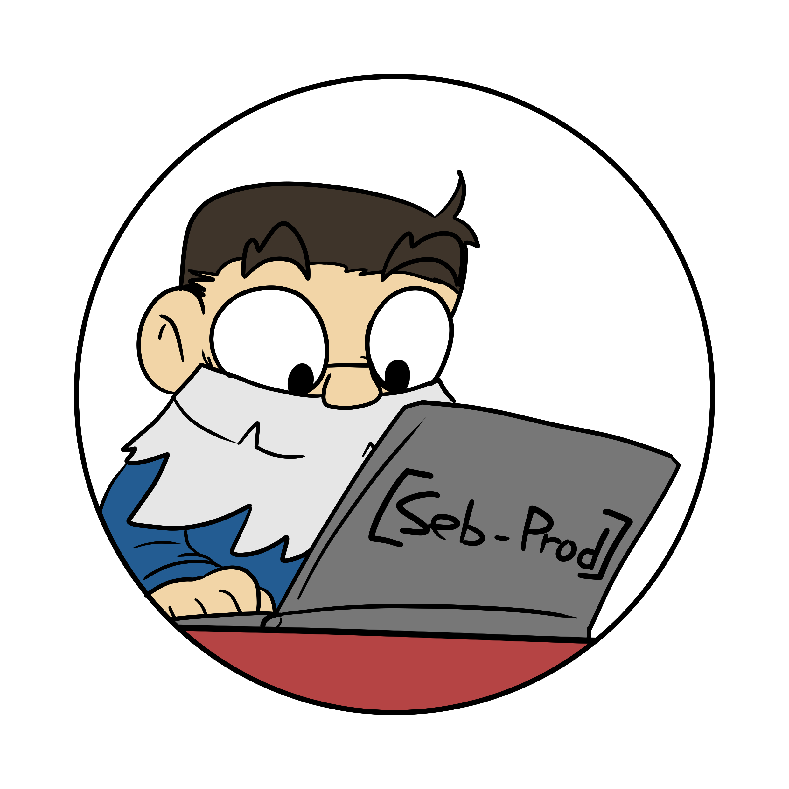

# 🧊 LeFrigo

<p align="center">
  
</p>

<p align="center">
  Architecture monorepo moderne full-stack TypeScript orientée SaaS.
</p>

<p align="center">
  LeFrigo est une base technique scalable conçue pour développer une application moderne.
</p>

---

# 🚀 Stack Technique

## Monorepo & Outillage

<p align="left">
  
  
  
</p>

- pnpm workspaces
- TypeScript full-stack
- Architecture modulaire scalable

---

## Frontend

<p align="left">
  
  
  
  
  
</p>

### Particularités

- Routing natif Next.js App Router
- Alias `@/`
- Architecture feature-first
- PWA ready
- Mobile-first
- Compatible iPhone LAN development

---

## Backend

<p align="left">
  
  
  
  
  
  
</p>

### Architecture

Le backend suit une architecture modulaire orientée SaaS.

Chaque module possède :

- controller
- service
- route
- repository
- dto
- validator

---

## Base de données

<p align="left">
  
  
  
</p>

### Fonctionnalités

- Migrations Prisma
- Prisma Studio
- Relations scalables
- Génération typée

---

## Shared Package

### packages/shared

Contient :

- types partagés
- DTOs
- helpers
- constantes
- utils

Alias :

```ts
import { User } from "@shared/types";
```

---

# 📁 Structure du projet

```txt
LeFrigo/
├── apps/
│   ├── api/
│   │   ├── prisma/
│   │   │   ├── schema.prisma
│   │   │   └── migrations/
│   │   │
│   │   ├── src/
│   │   │   ├── config/
│   │   │   ├── lib/
│   │   │   ├── middlewares/
│   │   │   ├── modules/
│   │   │   │   ├── auth/
│   │   │   │   └── users/
│   │   │   │
│   │   │   ├── routes/
│   │   │   ├── services/
│   │   │   ├── repositories/
│   │   │   ├── types/
│   │   │   └── server.ts
│   │   │
│   │   ├── .env
│   │   ├── package.json
│   │   └── tsconfig.json
│   │
│   └── web/
│       ├── public/
│       ├── src/
│       │   ├── app/
│       │   │   ├── dashboard/
│       │   │   ├── login/
│       │   │   ├── register/
│       │   │   ├── layout.tsx
│       │   │   └── page.tsx
│       │   │
│       │   ├── components/
│       │   ├── context/
│       │   ├── features/
│       │   ├── hooks/
│       │   ├── lib/
│       │   ├── services/
│       │   ├── styles/
│       │   └── types/
│       │
│       ├── .env.local
│       ├── next.config.ts
│       ├── package.json
│       └── tsconfig.json
│
├── packages/
│   └── shared/
│       ├── src/
│       │   ├── types/
│       │   ├── dto/
│       │   ├── constants/
│       │   └── utils/
│       │
│       ├── package.json
│       └── tsconfig.json
│
├── docker/
│   └── docker-compose.yml
│
├── images/
│   └── sebprod.png
│
├── scripts/
│   ├── start-mac.command
│   ├── start-mac.sh
│   └── setup.sh
│
├── .gitignore
├── package.json
├── pnpm-workspace.yaml
├── tsconfig.base.json
└── README.md
```

---

# 🔐 Authentification

Le projet utilise JWT.

## Fonctionnalités actuelles

- login
- register
- middleware auth
- protection dashboard
- persistance session frontend

---

# 📱 Support Mobile & PWA

Le frontend est pensé mobile-first.

Fonctionnalités prévues :

- PWA installable
- mode standalone
- adaptation mobile / desktop
- support iPhone
- navigation mobile

---

# 🐳 Docker

Le projet utilise Docker pour MySQL.

## Lancer Docker

```bash
cd docker
docker compose up -d
```

## Stop Docker

```bash
docker compose down
```

---

# 🗄 Prisma

## Générer Prisma Client

```bash
cd apps/api
pnpm prisma generate
```

## Migration

```bash
pnpm prisma migrate dev --name init
```

## Prisma Studio

```bash
pnpm prisma studio
```

---

# ⚙️ Développement

## Installation

```bash
pnpm install
```

---

## Lancer le projet

```bash
pnpm dev
```

Ou :

```bash
./scripts/start-mac.command
```

---

# 🔐 Gestion des environnements

Les variables d'environnement sont séparées par application.

## Backend API

```txt
apps/api/.env
apps/api/.env.dev
apps/api/.env.prod
```

Contient notamment :

- DATABASE_URL
- JWT_SECRET
- PORT

---

## Frontend Next.js

```txt
apps/web/.env.local
apps/web/.env.development
apps/web/.env.production
```

Contient notamment :

- NEXT_PUBLIC_API_URL

---

# 🌐 URLs locales

| Service        | URL                         |
|----------------|-----------------------------|
| Frontend       | http://localhost:3000        |
| Backend API    | http://localhost:4000        |
| Prisma Studio  | http://localhost:5555        |

---

# 🔥 Fonctionnalités prévues

## Frontend

- dashboard SaaS
- responsive mobile
- PWA complète
- UI modulaire
- design system

---

## Backend

- refresh token
- RBAC
- rate limiting
- logs
- monitoring
- validation avancée

---

## Métier LeFrigo

- gestion des frigos
- produits alimentaires
- dates d'expiration
- alertes
- scan code-barres
- partage familial

---

# 🧠 Philosophie Architecture

LeFrigo suit une architecture :

- simple
- scalable
- maintenable
- modulaire
- production-ready

Objectif :

Construire une vraie base SaaS moderne facilement extensible.

---

# 📌 Conventions

## TypeScript uniquement

Aucun JavaScript métier.

---

## Alias

### Frontend

```ts
@/
```

### Shared

```ts
@shared/
```

---

## CSS

Uniquement :

```txt
*.module.css
```

---

# 📄 Licence

<p align="center">
  
</p>

<p align="center">
  <strong>© 2026 Sébastien Drillaud (Seb-Prod)</strong><br/>
  Tous droits réservés.
</p>

<p align="center">
  <a href="https://github.com/Seb-Prod">
    
  </a>
  <a href="https://www.linkedin.com/in/sébastien-drillaud-b68b3318a/">
    
  </a>
</p>

> Ce projet est la propriété exclusive de Sébastien Drillaud.  
> Toute reproduction, distribution ou utilisation sans autorisation écrite préalable est interdite.